Docker: 
 Virtualization software
 Makes developing and deploying easier 
 Its a standardized unit, that has everything the application needs to run (packages lib dependency are stored container)

Why Docker? 
Before -- install and configure everything directly on os in local machine
After: Own isolated env Starts service using one command docker run
       Same cmd for al os n services Can run different version of same application

Docker Images:
Excutable application packsge source code and cmplt env config
Docker container:
Starts the application take a image and download it in local server layer stack ofimages linux as base image running env for image

Commands: 
docker info 

`docker info` provides detailed information about the Docker installation, including system-wide details, configuration, and status of Docker components such as containers, images, volumes, and networks.

docker version
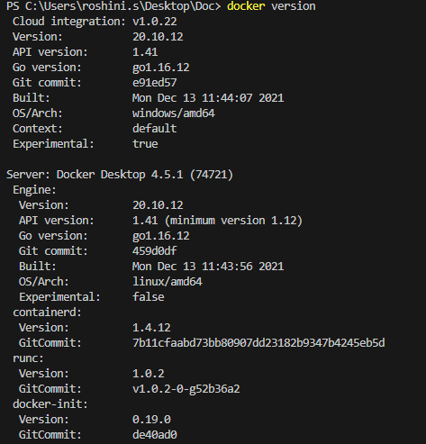

docker login
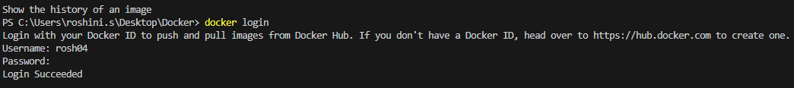

docker logout
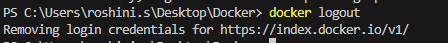

docker images
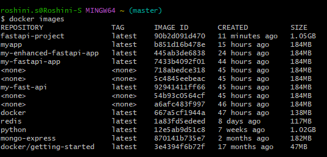
`docker images` lists all locally stored Docker images with details like repository, tag, image ID, and size.

docker ps
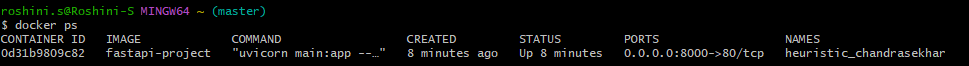
`docker ps` lists all currently running Docker containers with details like container ID, image, command, status, ports, and names.

docker help
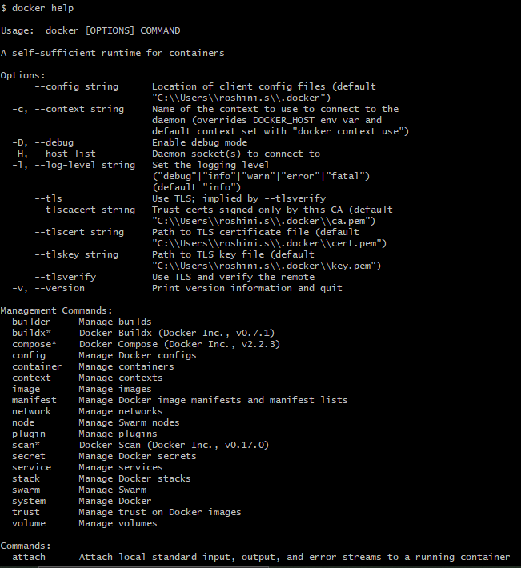
`docker help` displays information about Docker commands and their usage options.

docker pull (image)

`docker pull` downloads a Docker image from a registry to the local machine.

docker push (image)
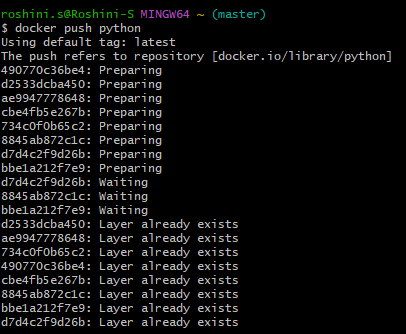
`docker push` uploads a local Docker image to a remote registry.

docker history
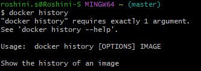

docker build
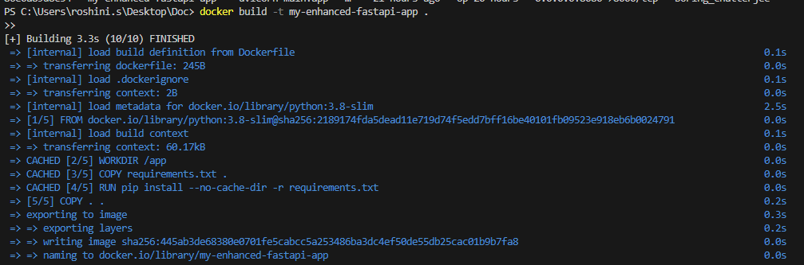
`docker build` creates a Docker image from a Dockerfile and a specified context.

docker run
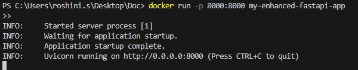
`docker run` creates and starts a new container from a specified Docker image.

output fastapi
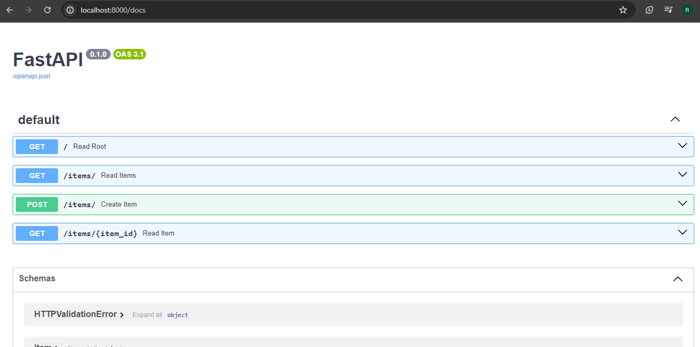

docker-compose.yaml

Create
vi editor
cat
